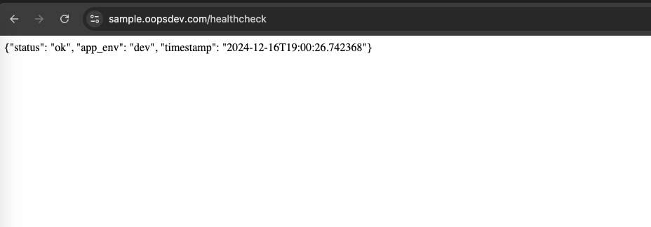

# Sample Application project
This project is a sample application designed to demonstrate various development and deployment practices.

## **Approach**
- **Dockerize**: Containerize the application using Docker to ensure consistency across different environments.
- **docker-compose for local development**: Use docker-compose to set up the local development environment, allowing for easy management of multi-container applications.
- **GitHub Actions workflow for CI/CD**: Implement continuous integration and continuous deployment using GitHub Actions to automate testing, building, and deployment processes.

## **Dockerfile**
This Dockerfile is designed to build and run a sample Python application using a multi-stage build process. The multi-stage build ensures that the final image is small, secure, and contains only the necessary runtime dependencies.

### Stages

#### Stage 1: Dependencies

1. **Base Image**: 
   - Uses `python:3.12.5-slim-bullseye` as the base image for building dependencies.
   - This image is slim and secure, reducing potential vulnerabilities.

2. **System Dependencies**:
   - Installs minimal system dependencies required for setup using `apt-get`.
   - Cleans up package lists to reduce image size.

3. **Poetry Installation**:
   - Installs the Poetry package manager using the official installation script.
   - Sets environment variables for Poetry and Python to disable interaction and prevent creating virtual environments.

4. **Working Directory**:
   - Sets the working directory to `/app`.

5. **Dependency Management Files**:
   - Copies `pyproject.toml` and `poetry.toml` to the working directory.
   - This allows better caching of dependency layers.

6. **Project Dependencies**:
   - Configures Poetry to limit installation workers and installs only the main dependencies, excluding development dependencies.

#### Stage 2: Runtime Image

1. **Base Image**:
   - Uses `python:3.12.5-slim-bullseye` as the base image for the final runtime.
   - This image is clean and slim, ensuring a minimal runtime environment.

2. **Runtime Dependencies**:
   - Installs minimal runtime dependencies using `apt-get`.
   - Cleans up package lists to reduce image size.

3. **Non-Root User**:
   - Creates a non-root user (`appuser`) for improved security, following the principle of least privilege.

4. **Working Directory**:
   - Sets the working directory to `/app`.

5. **Copy Dependencies**:
   - Copies installed dependencies from the builder stage to the runtime image.
   - This keeps the runtime image small and clean.

6. **Copy Application Code**:
   - Copies the application source code (`main.py`, `run.sh`, `.env`) to the working directory.

### Environment Variables

- `PYTHONFAULTHANDLER=1`: Improved error tracing.
- `PYTHONUNBUFFERED=1`: Prevents output buffering.
- `PYTHONHASHSEED=random`: Randomizes hash seed for security.
- `PYTHONDONTWRITEBYTECODE=1`: Prevents `.pyc` file generation.

### Security
- Non-root user execution.
- Minimal image size.
- Environment variable protection.
- Read-only file system.
- Dropped Linux capabilities.

**Note:** Refer to the comments in the Dockerfile for more details.

## **docker-compose**
This `docker-compose.yml` file sets up the local development environment for the sample Python application. It defines the services, volumes, and networks required to run the application in a containerized environment.

### Services
#### `app`
- Build Configuration:
  - Context: The build context is set to the current directory (`.`).
  - Dockerfile: Uses the `Dockerfile` in the current directory to build the image.
- Port Mapping:
  - Maps port `3000` on the host to port `3000` in the container.
  - Only accessible from `127.0.0.1` for security.
- Volumes:
  - Bind Mount: Mounts the current directory to `/app` in the container.
  - Read-Only: The bind mount is set to read-only for security.
- Linux Capabilities Management:
  - Drop All Capabilities: Drops all default Linux capabilities.
  - Add Necessary Capability: Adds only the `NET_BIND_SERVICE` capability.
- Filesystem:
  - Read-Only Root Filesystem: Sets the root filesystem to read-only.
  - Temporary Filesystems: Creates temporary filesystems for `tmp` and `/run`.
- Security Options:
  - No New Privileges: Prevents the container from gaining new privileges.
- Restart Policy:
  - On-Failure: Restarts the container only on failure, preventing infinite restarts.
- Logging Configuration:
  - Driver: Uses the `json-file` logging driver.
  - Options:
    - Max Size: Limits the maximum log file size to `200k`.
    - Max File: Limits the maximum number of log files to `3`.

### Additional Information
- Environment Variables: Ensure that the necessary environment variables are set in the `.env` file.
- Application Code: The application source code should be in the current directory and will be mounted to `/app` in the container.
- Security: The configuration follows best practices for security, including running as a non-root user, using a read-only filesystem, and dropping unnecessary Linux capabilities.

## `docker-compose` usage
To build and run the Docker container using Docker Compose, use the following commands:

#### Building the Container

```sh
docker-compose build
```

#### Running the Application

```sh
docker-compose up
```

#### Stopping the Application

```sh
docker-compose down
```

## **Additional Changes in Application**
- Add `python-dotenv` library to `pyproject.toml` to manage environment variables.
- Import `python-dotenv` in `main.py` to load environment variables from a `.env` file.
- Modify `run.sh` script as necessary to ensure the application runs correctly with the new setup.

## **GitHub Actions Workflow**
This `cicd.yaml` file defines the CI/CD pipeline for the DevOps Test App using GitHub Actions. The pipeline automates the processes of building, testing, and deploying the application to Amazon ECS.

### **Workflow Overview**
The workflow is triggered on the following events:
- Push to the `main` branch
- Pull request to the `main` branch

### **Permissions**
The workflow requires the following permissions:
- `id-token: write`
- `contents: read`

### **Environment Variables**
The following environment variables are used in the workflow:
- `AWS_REGION`: The AWS region where the resources are located.
- `ECR_REPOSITORY`: The name of the ECR repository.
- `ECS_CLUSTER`: The name of the ECS cluster.
- `ECS_SERVICE`: The name of the ECS service.
- `ECS_TASK_DEFINITION`: The path to the ECS task definition file.
- `ECS_CONTAINER_NAME`: The name of the ECS container.

The following secrets are used in the workflow:
- `AWS_ROLE_ARN`: The ARN of the AWS role to assume.
- `AWS_ACCOUNT_ID`: The AWS account ID.

### **Jobs**
#### **CI: Build and Test**
This job runs on `ubuntu-latest` and performs the following steps:
1. **Checkout Code**:
    - Uses the `actions/checkout@v4` action to check out the code from the repository.
2. **Set up Python**:
    - Uses the `actions/setup-python@v4` action to set up Python 3.12.5.
3. **Install Poetry**:
    - Installs Poetry using the official installation script.
    - Adds Poetry to the GitHub Actions PATH.
4. **Install Dependencies**:
    - Configures Poetry to not create virtual environments.
    - Locks dependencies and installs them.
5. **Run Tests**:
    - Runs the tests using `pytest`.

#### **CD: Build Docker Image and Deploy to ECS**
This job depends on the `ci` job and runs on `ubuntu-latest`. It performs the following steps:
1. **Checkout Code**:
    - Uses the `actions/checkout@v4` action to check out the code from the repository.
2. **Create .env file**:
    - Creates a .env file and populates it with necessary environment variables.
3. **Replace placeholders in task definition**:
    - Replace the placeholders in the task definition by substituting `{{AWS_ACCOUNT_ID}}` and `{{AWS_REGION}}` with the corresponding values stored in GitHub Secrets. 
4. **Validate Task Definition**:
    - Validates the ECS task definition file using `jq`.
5. **Configure AWS Credentials**:
    - Uses the `aws-actions/configure-aws-credentials@v4` action to configure AWS credentials.
6. **Login to Amazon ECR**:
    - Uses the `aws-actions/amazon-ecr-login@v2` action to log in to Amazon ECR.
7. **Set up Docker Buildx**:
    - Uses the `docker/setup-buildx-action@v3` action to set up Docker Buildx.
8. **Build Docker Image**:
    - Uses the `docker/build-push-action@v5` action to build and push the Docker image to Amazon ECR.
9. **Render Amazon ECS Task Definition**:
    - Uses the `aws-actions/amazon-ecs-render-task-definition@v1` action to render the ECS task definition.
10. **Deploy to Amazon ECS Service**:
    - Uses the `aws-actions/amazon-ecs-deploy-task-definition@v2` action to deploy the task definition to the ECS service.

### **Task Definition**
The ECS task definition is located at `.aws/task-definition.json`. It defines the following:
- **Family**: The name of the task definition family.
- **Task Role ARN**: The ARN of the IAM role that the task can assume.
- **Execution Role ARN**: The ARN of the IAM role that grants the ECS agent permission to pull images and publish logs.
- **Network Mode**: The Docker networking mode to use for the containers in the task.
- **Requires Compatibilities**: Specifies that the task requires Fargate compatibility.
- **CPU and Memory**: The amount of CPU and memory used by the task.
- **Container Definitions**: Defines the containers in the task, including:
    - **Name**: The name of the container.
    - **Image**: The Docker image to use for the container.
    - **CPU and Memory**: The amount of CPU and memory allocated to the container.
    - **Port Mappings**: The port mappings for the container.
    - **Essential**: Specifies whether the container is essential.
    - **Log Configuration**: The log configuration for the container, using AWS CloudWatch Logs.

### **Usage**
To use this CI/CD pipeline, ensure that the necessary environment variables are set in the GitHub repository settings. The pipeline will automatically run on push and pull request events to the `main` branch.

## **Infrastructure**
Refer to this link for more details about the infrastructure: https://github.com/rhinozD/sample-terraform

## **Demo**

